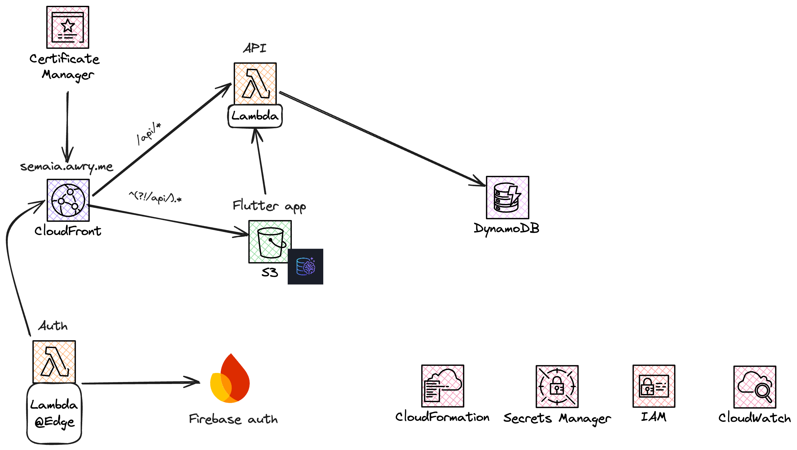

# Semaia

High-level overview of the Semaia project. This repository contains:

- A Flutter front-end (web SPA and macOS desktop)
- A lightweight streaming backend (ASGI on AWS Lambda)
- Infrastructure-as-code for CloudFront + S3 hosting and a Lambda-based API with response streaming

See the detailed READMEs for each part:

- [Front-end app](app/README.md)
- [API](backend/README.md)
- [Infrastructure](infrastructure/README.md)

## Architecture

- [Architecture diagram](infrastructure/architecture.png)
- Summary:
    - CloudFront serves the SPA from S3 and routes `/api/*` to a Lambda Function URL origin via an Origin Access
      Control (SigV4).
    - A viewer-request Lambda@Edge validates Firebase ID tokens and injects user headers for the API.
    - The API runs an ASGI app with AWS Lambda Web Adapter in response streaming mode (SSE).

For more details, refer to [infrastructure/README.md](infrastructure/README.md).

## Quick start

- Running the app (web or macOS): see [app/README.md](app/README.md)
    - Configure via `--dart-define` (env, domain, apiGateway, appName)
    - Auth uses Google Sign-In + Firebase Auth; the app sends `Authorization: Bearer <idToken>`
- Backend design, routes, and local dev tips: see [backend/README.md](backend/README.md)
- Deploying the stack (CloudFront/S3 + Lambda API): see [infrastructure/README.md](infrastructure/README.md)

## Key concepts

- Streaming API: Server‑Sent Events (SSE) from Lambda to the client for long-running operations
- Security:
    - CloudFront → Lambda Function URL secured via Origin Access Control
    - Viewer-request Lambda@Edge validates Firebase ID tokens and forwards `x-user-*` headers
- Data: DynamoDB table for connectors, chats, and messages

## Repository layout

- `app/` — Flutter app and shared Dart packages (models, state, API client)
- `backend/` — ASGI app and domain logic
- `infrastructure/` — SAM/CloudFormation templates, deployment notes, and the architecture diagram

## Troubleshooting

Start with the dedicated guides:

- App issues (build/run/auth/SSE): [app/README.md](app/README.md#troubleshooting)
- Infra issues (CloudFront, certs, streaming, OAC): [infrastructure/README.md](infrastructure/README.md#troubleshooting)
- Backend behavior and headers: [backend/README.md](backend/README.md)
